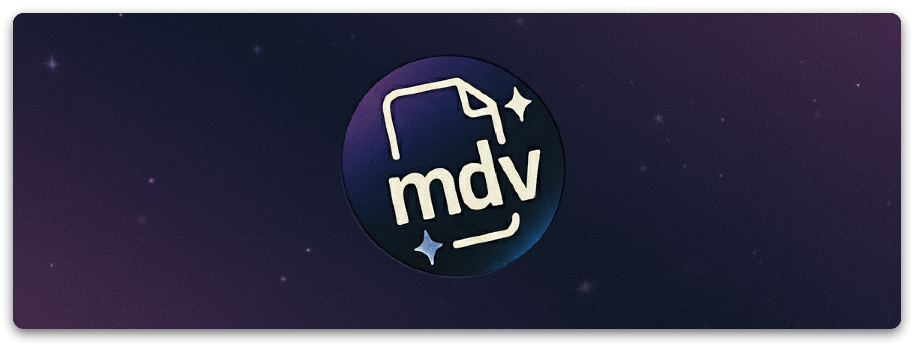
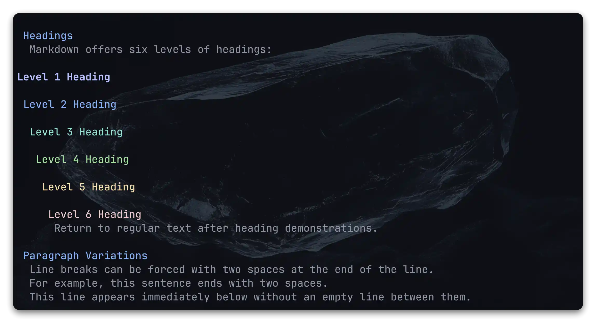
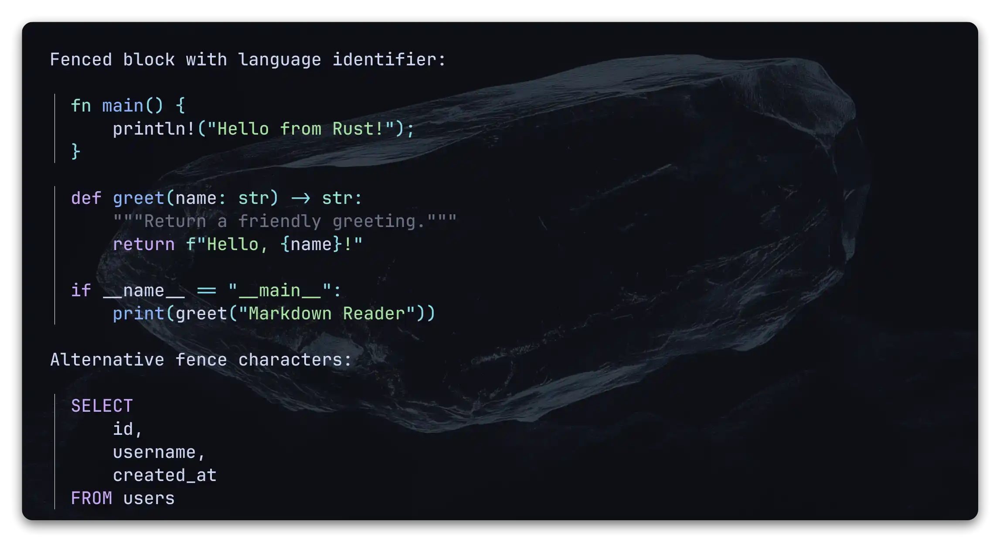

<div style="text-align: center;">
  
</div>

<h1 align="center">🗒️mdv</h1>
<p align="center">
  <b>Быстрый и настраиваемый просмотрщик Markdown для терминала</b><br>
  <i>Отображайте, настраивайте и отслеживайте Markdown, не покидая командную строку</i>
</p>

> [!TIP]
> **English version:** [README.md](README.md)

> [!NOTE]
> mdv — терминальная утилита для точного рендеринга Markdown в ANSI-совместимых терминалах. В её арсенале:
>
> - **Рендеринг для терминала** — Подсветка синтаксиса, опциональный HTML-вывод и аккуратная работа с инлайновым форматированием.
> - **Гибкие схемы верстки** — Управляйте шириной, стратегией переноса, отступами заголовков и поведением таблиц под ваш терминал.
> - **Контроль ссылок** — Переключайтесь между кликабельными, инлайн- и табличными ссылками, выбирайте правила обрезки длинных URL.
> - **Расширенное тематизирование** — Встроенные палитры и моментальные переопределения цветов интерфейса и подсветки кода.
> - **Живой мониторинг** — Следите за файлами с `--monitor`, чтобы видеть обновления сразу после сохранения.
> - **CLI, удобный для скриптов** — Чтение из stdin, прыжки к разделам через `--from`, перенос конфигурации между машинами.

> [!IMPORTANT]
>
> ### Требования
>
> - Установленный Rust
> - Терминал с поддержкой ANSI-цветов для полноценного отображения

<div style="text-align: center;">
  
</div>

## Установка

### Установка с crates.io

```bash
cargo install mdv
```

Так вы установите последнюю опубликованную версию из crates.io в каталог бинарников Cargo.

### Установка из исходников

```bash
git clone https://github.com/WhoSowSee/mdv.git
cd mdv
cargo install --path .
```

Команда соберёт mdv и установит бинарник в каталог Cargo (обычно `~/.cargo/bin`).

### Запуск без установки

```bash
cargo build --release
./target/release/mdv README.md
```

Можно запускать бинарник из `target/release` напрямую или добавить путь к нему в `PATH`.

## Использование

```text
mdv [OPTIONS] [FILE]
```

Также, mdv поддерживает чтение из стандартного ввода (stdin) и работу в конвейерах (pipe)

```text
mdv [OPTIONS] -
mdv [OPTIONS] | mdv
```

### Вывод и рабочий процесс

- `-H, --html` — печать HTML вместо терминального форматирования.
- `-A, --no-colors` — удаление ANSI-стилей независимо от выбранной темы.
- `-C, --hide-comments` — скрытие Markdown-комментариев в итоговом выводе.
- `-i, --theme-info [FILE]` — показ активной палитры; при указании `FILE` рендерит документ вместе со сведениями о теме.
- `-f, --from <TEXT>` — рендер начиная с первой строки, содержащей `<TEXT>`. Добавление `:<lines>` ограничит число строк (например, `--from "Install:20"`).
- `-r, --reverse` — рендер документа с конца, сохраняя форматирование блоков.
- `-m, --monitor` — наблюдение за файлом и автоматический перерендер при изменениях.
- `-F, --config-file <CONFIG_PATH>` — чтение настроек из указанного файла.
- `-n, --no-config` — игнорирование конфигурационных файлов (используются только параметры CLI и значения по умолчанию).

### Темы

- `-t, --theme <NAME>` — выбор встроенной темы (по умолчанию `terminal`).
- `-T, --code-theme <NAME>` — выбор палитры подсветки кода (по умолчанию `terminal`).
- `-s, --style-code-block <simple|pretty>` — стиль оформления блоков кода: одинарная граница или рамка (по умолчанию `pretty`).
- `-y, --custom-theme <key=value;...>` — переопределение цветов интерфейса поверх выбранной темы.
- `-Y, --custom-code-theme <key=value;...>` — переопределение цветов подсветки кода в том же формате, что и `--custom-theme`.

### Разметка и переносы

- `-c, --cols <N>` — фиксированная ширина вывода. Если не задана, mdv использует ширину терминала или запасное значение 80.
- `-b, --tab-length <N>` — замена символов табуляции на `N` пробелов (по умолчанию 4).
- `-W, --wrap <char|word|none>` — режим переноса текста (по умолчанию `char`).
- `-w, --table-wrap <fit|wrap|none>` — логика отображения широких таблиц (по умолчанию `fit`).
- `-d, --heading-layout <level|center|flat|none>` — схема выравнивания заголовков (по умолчанию `level`).
- `-I, --smart-indent` — сглаживание скачков отступов между уровнями заголовков в режиме `level`.

### Видимость элементов

- `-L, --no-code-language` — скрытие подписи языка над блоками кода, если она доступна.
- `-e, --show-empty-elements` — отображение пустых списков, цитат и блоков кода, которые обычно скрываются.
- `-g, --no-code-guessing` — отключение эвристики определения языка; неизвестные блоки остаются текстом.

### Ссылки

- `-u, --link-style <clickable|fclickable|inline|inlinetable|endtable|hide>` — способ отображения ссылок (по умолчанию `clickable`).
- `-l, --link-truncation <wrap|cut|none>` — стратегия укорочения длинных ссылок (по умолчанию `wrap`).

### Справочная информация

- `-h, --help` — вывод справки.
- `-V, --version` — отображение текущей версии.

## Конфигурация

mdv объединяет настройки из нескольких источников в порядке уменьшения приоритета:

1. Параметры командной строки (максимальный приоритет).
2. Переменная окружения `MDV_CONFIG_PATH` или флаг `--config-file`.
3. Пользовательские файлы в `~/.config/mdv/` (`~\.config\mdv\` в Windows).

Файлы конфигурации поддерживают YAML (`.yaml` или `.yml`). В каталоге `docs/examples/config.yaml` расположен полный шаблон с комментариями:

```yaml
# docs/examples/config.yaml
theme: "monokai"
code_theme: "monokai"
wrap: "char"
table_wrap: "fit"
heading_layout: "level"
smart_indent: true
link_style: "inlinetable"
link_truncation: "wrap"
```

## Переменные окружения

- `MDV_CONFIG_PATH` — кастомный путь к конфигурационному файлу.
- `MDV_NO_COLOR` — принимает `True` или `False` и принудительно включает или отключает цвета независимо от темы и параметров CLI.

## Темы

Доступны встроенные темы:

<details>
  <summary><code>terminal</code></summary>

  <div style="text-align: center;">
    
  </div>
  <div style="text-align: center;">
    
  </div>
  <div style="text-align: center;">
    
  </div>
</details>

<details>
  <summary><code>monokai</code></summary>

  <div style="text-align: center;">
    
  </div>
  <div style="text-align: center;">
    
  </div>
  <div style="text-align: center;">
    
  </div>
</details>

<details>
  <summary><code>solarized-dark</code></summary>

  <div style="text-align: center;">
    
  </div>
  <div style="text-align: center;">
    
  </div>
  <div style="text-align: center;">
    
  </div>
</details>

<details>
  <summary><code>nord</code></summary>

  <div style="text-align: center;">
    
  </div>
  <div style="text-align: center;">
    
  </div>
  <div style="text-align: center;">
    
  </div>
</details>

<details>
  <summary><code>tokyonight</code></summary>

  <div style="text-align: center;">
    
  </div>
  <div style="text-align: center;">
    
  </div>
  <div style="text-align: center;">
    
  </div>
</details>

<details>
  <summary><code>kanagawa</code></summary>

  <div style="text-align: center;">
    
  </div>
  <div style="text-align: center;">
    
  </div>
  <div style="text-align: center;">
    
  </div>
</details>

<details>
  <summary><code>gruvbox</code></summary>

  <div style="text-align: center;">
    
  </div>
  <div style="text-align: center;">
    
  </div>
  <div style="text-align: center;">
    
  </div>
</details>

<details>
  <summary><code>material-ocean</code></summary>

  <div style="text-align: center;">
    
  </div>
  <div style="text-align: center;">
    
  </div>
  <div style="text-align: center;">
    
  </div>
</details>

<details>
  <summary><code>catppucin</code></summary>

  <div style="text-align: center;">
    
  </div>
  <div style="text-align: center;">
    
  </div>
  <div style="text-align: center;">
    
  </div>
</details>

Выбирайте их параметром `--theme` или задавайте по умолчанию в конфигурации.

Для точной настройки используйте `--custom-theme` и `--custom-code-theme`. Переопределения передаются в формате `ключ=значение`, пары разделяются точкой с запятой. Ключи соответствуют полям палитры (`text`, `h1`, `border`, `keyword`, `function` и т.д.). Значения поддерживают форматы `#rrggbb`, `r,g,b`, именованные цвета ANSI (`red`, `darkgrey`) и индексы 256-цветной палитры (`ansi(42)`).

Команда `mdv --theme-info` отображает выбранную палитру; добавление пути (`mdv --theme-info README.md`) позволяет посмотреть, как цвета применяются к документу. Используйте `examples/config.yaml` как отправную точку для своих тем и храните настройки в системе контроля версий.

## История звёзд

[](https://star-history.com/#WhoSowSee/mdv&Date)

## Лицензия

Продукт распространяется под лицензией MIT. Для получения дополнительной информации ознакомьтесь с файлом [LICENSE](LICENSE)
