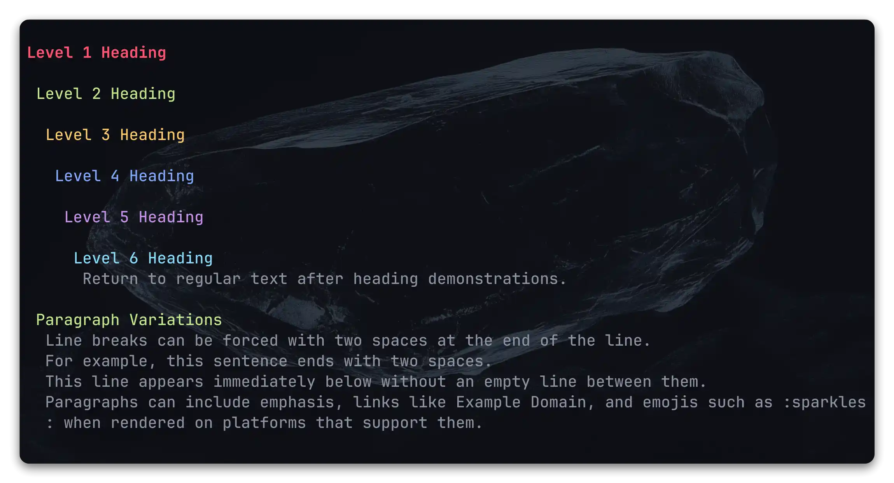

<h1 align="center">🗒️mdv</h1>
<p align="center">
  <b>Fast, themeable Markdown viewer for the terminal</b><br>
  <i>Render, tweak, and monitor Markdown without leaving your shell</i>
</p>

> [!TIP]
> **Russian version:** [README-RU.md](README-RU.md)

> [!NOTE]
> mdv is a terminal Markdown viewer focused on precise rendering inside ANSI-capable terminals. It offers:
>
> - **Terminal-first rendering** - Syntax highlighted output, optional HTML export, and careful handling of inline formatting.
> - **Reusable layouts** - Control width, wrapping strategy, heading indentation, and table behavior to match your workspace.
> - **Link presentation control** - Switch between clickable, inline, or tabular links and choose how long URLs are truncated.
> - **Rich theming** - Built-in color schemes plus on-the-fly overrides for UI and syntax palettes.
> - **Live monitoring** - Watch files with `--monitor` to refresh the view whenever the source changes.
> - **Script friendly CLI** - Read from stdin, jump to sections with `--from`, and share configuration files across machines.

> [!IMPORTANT]
>
> ## Required dependencies:
>
> - Rust toolchain
> - Terminal with ANSI color support for the best experience

<div style="text-align: center;">
  
</div>

## Installation

### Install from crates.io

```bash
cargo install mdv
```

This installs the latest published release from crates.io into your Cargo bin directory.

### Install from source

```bash
git clone https://github.com/WhoSowSee/mdv.git mdv
cd mdv
cargo install --path .
```

The command above builds mdv and places the binary into the Cargo bin directory (usually `~/.cargo/bin`).

### Run locally without installing

```bash
cargo build --release
./target/release/mdv README.md
```

Use the `mdv` binary from `target/release` directly or add it to your PATH.

## Usage

```text
mdv [OPTIONS] [FILE]
```

Also, mdv supports reading from standard input (stdin) and working in pipelines

```text
mdv [OPTIONS] -
mdv [OPTIONS] | mdv
```

### Output and workflow

- `-H, --html` prints HTML instead of terminal formatting.
- `-A, --no-colors` strips ANSI styling regardless of the selected theme.
- `-C, --hide-comments` removes Markdown comments from the rendered output.
- `-i, --theme-info [FILE]` shows the active palette; when `FILE` is provided it renders the file along with palette information.
- `-f, --from <TEXT>` starts rendering from the first match of `<TEXT>`. Adding `:<lines>` limits the number of lines (for example `--from "Install:20"`).
- `-m, --monitor` watches the source file and re-renders when it changes.
- `-F, --config-file <CONFIG_PATH>` reads configuration from the provided file.
- `-n, --no-config` skips loading configuration files (uses CLI options and defaults only).

### Theming

- `-t, --theme <NAME>` chooses a built-in theme (default `terminal`).
- `-T, --code-theme <NAME>` sets the syntax highlight palette (default `terminal`).
- `-s, --style-code-block <simple|pretty>` switches between a single gutter and a boxed frame for code blocks (default `simple`).
- `-y, --custom-theme <key=value;...>` overrides UI colors on top of the selected theme.
- `-Y, --custom-code-theme <key=value;...>` overrides syntax colors using the same format as `--custom-theme`.

### Layout and wrapping

- `-c, --cols <N>` enforces the output width. When omitted mdv uses the detected terminal width or a fallback of 80 columns.
- `-b, --tab-length <N>` replaces tab characters with `N` spaces (default 4).
- `-W, --wrap <char|word|none>` selects the text wrapping mode (default `char`).
- `-w, --table-wrap <fit|wrap|none>` chooses how wide tables are handled (default `fit`).
- `-d, --heading-layout <level|center|flat|none>` controls heading indentation (default `level`).
- `-I, --smart-indent` smooths indentation jumps between heading levels in `level` mode.

### Content visibility

- `-L, --show-code-language` displays the language label above code blocks when metadata is available.
- `-e, --show-empty-elements` keeps normally hidden empty lists, block quotes, and code blocks in the output.
- `-g, --no-code-guessing` disables heuristic detection of code block languages (unknown blocks remain plain text).

### Links

- `-u, --link-style <clickable|fclickable|inline|inlinetable|hide>` changes how links are displayed (default `clickable`).
- `-l, --link-truncation <wrap|cut|none>` determines how long links are shortened (default `wrap`).

### Information

- `-h, --help` shows the help text.
- `-V, --version` prints the current version.

## Configuration

mdv merges settings from several sources in the following order of precedence:

1. CLI options (highest priority).
2. Environment variable `MDV_CONFIG_PATH` or the `--config-file` flag.
3. User-level configuration under `~/.config/mdv/` (`~\.config\mdv\` on Windows).

Configuration files must be written in YAML (`.yaml` or `.yml`). See `docs/examples/config.yaml` for a complete template including inline documentation:

```yaml
# docs/examples/config.yaml
theme: 'monokai'
code_theme: 'monokai'
wrap: 'char'
table_wrap: 'fit'
heading_layout: 'level'
smart_indent: true
link_style: 'inlinetable'
link_truncation: 'wrap'
```

## Environment variables

- `MDV_CONFIG_PATH` - custom path to configuration file.
- `MDV_NO_COLOR` - accepts `True` or `False` and enforces color usage regardless of CLI arguments or theme settings.

## Themes

Built-in themes include:

<details>
  <summary><code>terminal</code></summary>

  <div style="text-align: center;">
    
  </div>
  <div style="text-align: center;">
    
  </div>
  <div style="text-align: center;">
    
  </div>
</details>

<details>
  <summary><code>monokai</code></summary>

  <div style="text-align: center;">
    
  </div>
  <div style="text-align: center;">
    
  </div>
  <div style="text-align: center;">
    
  </div>
</details>

<details>
  <summary><code>solarized-dark</code></summary>

  <div style="text-align: center;">
    
  </div>
  <div style="text-align: center;">
    
  </div>
  <div style="text-align: center;">
    
  </div>
</details>

<details>
  <summary><code>nord</code></summary>

  <div style="text-align: center;">
    
  </div>
  <div style="text-align: center;">
    
  </div>
  <div style="text-align: center;">
    
  </div>
</details>

<details>
  <summary><code>tokyonight</code></summary>

  <div style="text-align: center;">
    
  </div>
  <div style="text-align: center;">
    
  </div>
  <div style="text-align: center;">
    
  </div>
</details>

<details>
  <summary><code>kanagawa</code></summary>

  <div style="text-align: center;">
    
  </div>
  <div style="text-align: center;">
    
  </div>
  <div style="text-align: center;">
    
  </div>
</details>

<details>
  <summary><code>gruvbox</code></summary>

  <div style="text-align: center;">
    
  </div>
  <div style="text-align: center;">
    
  </div>
  <div style="text-align: center;">
    
  </div>
</details>

<details>
  <summary><code>material-ocean</code></summary>

  <div style="text-align: center;">
    
  </div>
  <div style="text-align: center;">
    
  </div>
  <div style="text-align: center;">
    
  </div>
</details>

<details>
  <summary><code>catppucin</code></summary>

  <div style="text-align: center;">
    
  </div>
  <div style="text-align: center;">
    
  </div>
  <div style="text-align: center;">
    
  </div>
</details>

Switch between them with `--theme` or set a default in your configuration file.

Use `--custom-theme` to override UI colors and `--custom-code-theme` to fine-tune syntax highlighting. Overrides accept `key=value` pairs separated by semicolons, where keys match palette fields (for example `text`, `h1`, `border`, `keyword`, `function`). Color values can be hex codes (`#rrggbb`), comma-separated RGB (`187,154,247`), named ANSI colors (`red`, `darkgrey`), or 256-color indexes (`ansi(42)`).

Run `mdv --theme-info` to preview the active palette. Add a path (`mdv --theme-info README.md`) to inspect how colors apply to a document. Starting from `examples/config.yaml` you can build your own theme variants and keep them in version control.

## Star History

[](https://star-history.com/#WhoSowSee/mdv&Date)

## License

Product is MIT-licensed. For more information check the [LICENSE](LICENSE) file
