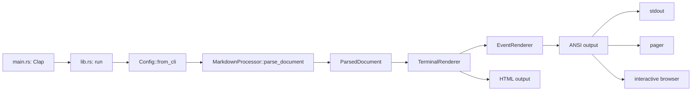

# Architecture

`mdv` is a single Rust package with a binary entry point and a reusable library API. It transforms Markdown into an owned event stream and then into ANSI-compatible terminal text or an HTML document.

## Layers

| Layer | Primary files | Responsibility |
|---|---|---|
| Startup and routing | `src/main.rs`, `src/lib.rs` | Parse arguments, select a mode, read input, and deliver output. |
| User configuration | `src/cli.rs`, `src/config.rs`, `src/preset.rs` | Define the CLI contract, load YAML and presets, and normalize the effective `Config`. |
| Markdown pipeline | `src/markdown.rs`, `src/markdown/*` | Preprocess source, run `pulldown-cmark`, and normalize events. |
| Terminal facade | `src/renderer/terminal.rs` | Initialize themes and syntaxes, render line numbers and margins, and export HTML. |
| Event renderer | `src/renderer/event/*` | Process the Markdown event stream with element-specific stateful handlers. |
| Low-level presentation | `src/theme/*`, `src/terminal.rs`, `src/table/*`, `src/utils.rs` | Colors, ANSI/OSC sequences, display width, wrapping, and table borders. |
| Interactive output | `src/interactive/*`, `src/pager/*`, `src/monitor.rs` | Browse documents, page output, refresh files, and integrate with an editor. |

## Primary data flow

1. `main` initializes logging and creates both `Cli` and `ArgMatches`.
2. `run` handles service modes such as help, configuration initialization, and theme or preset information.
3. `Config::from_cli` produces one validated settings snapshot.
4. `MarkdownProcessor::parse_document` returns owned front matter plus `Vec<Event<'static>>`; renderers do not borrow the source string.
5. `TerminalRenderer` chooses themes and syntaxes, creates `EventRenderer`, and applies line numbers and margins.
6. The result is printed, passed to the pager, or used by interactive mode.

## Mode routing

`lib::run` chooses exactly one primary execution path:

- help and configuration generation finish before Markdown input is read;
- `--preset-info` and `--theme-info` without a file print metadata and return;
- `--interactive`, or an implicitly selected interactive target, enters `interactive::run`;
- an ordinary file or standard input goes through `render_document`;
- `--pager` with terminal output passes a `PagerDocument` to `pager::page`;
- `--monitor` starts only after ordinary initial output and never shares an active pager.

## State ownership

| State | Owner | Reason |
|---|---|---|
| Effective user settings | `Config` | Downstream modules must not parse CLI arguments or YAML again. |
| Markdown preprocessing | `MarkdownProcessor` | Front matter extraction and all source transformations happen before terminal output is constructed. |
| Current document state | `EventRenderer` | Lists, links, footnotes, tables, and callouts depend on event order. |
| Theme and syntax set | `TerminalRenderer` | Document-wide resources are selected once and shared by event handlers. |
| Pager document | `RwLock<PagerDocument>` | The watcher and input classifier update one coherent snapshot. |
| Browser state | `interactive::browser::BrowserState` | The UI owns filtering, selection, pages, and discovery errors. |

## Key types

| Type | File | Contract |
|---|---|---|
| `Cli` | `src/cli.rs` | Stable Clap surface and raw argument values. |
| `Config` | `src/config.rs` | Runtime settings after all sources and overrides are applied. |
| `MarkdownProcessor` | `src/markdown.rs` | Converts `&str` into a `ParsedDocument` with optional YAML front matter and normalized events. |
| `ParsedDocument` | `src/markdown.rs` | Owns document metadata and the Markdown body event stream. |
| `TerminalRenderer` | `src/renderer/terminal.rs` | Facade for rendering one document to ANSI or HTML. |
| `EventRenderer<'a>` | `src/renderer/event/core.rs` | Stateful machine that consumes the Markdown event stream. |
| `Theme` | `src/theme/types.rs` | Complete semantic palette for Markdown and syntax highlighting. |
| `TableRenderer` | `src/table.rs` | Low-level table rendering with Unicode-aware width calculations. |
| `PagerDocument` | `src/pager/document.rs` | Rendered output, source text, title, and status-bar transparency. |

## Architectural invariants

- Renderers receive a normalized `Config`; event handlers never read the environment or YAML.
- Handlers under `renderer/event/` mutate one `EventRenderer` and do not create competing pipelines.
- Visible width is calculated after ANSI and OSC metadata is removed; byte length is never treated as terminal width.
- Source-line markers are internal and must disappear before output reaches the user.
- Table links restore ANSI and OSC sequences after `comfy-table` layout, because escape sequences would corrupt width calculation.
- Themes and user overrides become semantic `ThemeElement` values rather than positional string modifications.
- Pager refresh updates both rendered output and source; copying without a selection uses the original Markdown.
- Errors propagate through `anyhow::Result` or `MdvError`; hidden fallback branches are not part of the design.

## Subsystem dependencies

- `markdown` depends on `Config`, but not on the renderer.
- `renderer` depends on `Config`, `theme`, `table`, `terminal`, `utils`, and specialized parsers.
- `theme` uses `user_themes` for embedded and user YAML; the renderer builds the final `ThemeManager`.
- `interactive` and `pager` reuse the library render path through callbacks instead of duplicating the Markdown pipeline.
- Integration tests exercise the public binary contract; unit tests protect local module invariants.
