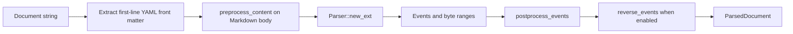

# Markdown Pipeline

The `markdown` module separates optional YAML front matter and converts the Markdown body into a stable stream of `pulldown_cmark::Event<'static>`. It neither chooses colors nor constructs terminal output.

## Facade

[src/markdown.rs](../../src/markdown.rs) contains:

- `MarkdownProcessor { config, options }`;
- `ParsedDocument { events, front_matter }` and `FrontMatter { raw, properties }`;
- the internal `BLANK_LINE_MARKER`;
- declarations for specialized submodules;
- re-exports for code-language detection.

The public contract remains `MarkdownProcessor::new(config)` and `parse(markdown)`. Application rendering uses the crate-internal `parse_document(markdown)` to retain front matter alongside body events.

## `parse` stages

`pulldown-cmark` runs through `into_offset_iter`, so every event carries a byte range in the transformed source. Those ranges support source-line numbering and restoration of omitted blank lines.

## Exact preprocessing order

[src/markdown/parsing.rs](../../src/markdown/parsing.rs) applies transformations sequentially:

1. Unless `front_matter: source` is selected, an exact `---` block is extracted only when its opening delimiter is the first line, it has an exact closing delimiter, and its YAML root is a property mapping.
2. `--from` restricts the Markdown body source-line range.
3. Tab-indented fenced code blocks are normalized.
4. Explicit `\` lines become blank-line markers.
5. Task-list termination is repaired.
6. Pretty-checkbox mode normalizes a backslash before a checkbox marker.
7. Admonition syntax becomes a callout blockquote.
8. Callout markers are separated from setext headings.
9. Blockquote prefixes and blank lines inside quotes are normalized.

Every transformation goes through `source_lines::apply_transform`, keeping inserted and removed lines synchronized with the source-line map.

## Module files

| File | Responsibility |
|---|---|
| [src/markdown/parsing.rs](../../src/markdown/parsing.rs) | Constructor, front matter extraction, `parse`, preprocessing, and `--from` filtering. |
| [src/markdown/admonitions.rs](../../src/markdown/admonitions.rs) | Convert `:::note`, `:::{note} Title`, and `!!! note` to a compatible callout marker. |
| [src/markdown/blockquotes.rs](../../src/markdown/blockquotes.rs) | Parse `>` prefixes, nesting, and explicit blank lines inside blockquotes. |
| [src/markdown/fences.rs](../../src/markdown/fences.rs) | Find fence markers and normalize tab-indented fences without losing inner indentation. |
| [src/markdown/task_lists.rs](../../src/markdown/task_lists.rs) | Terminate task-list blocks and normalize alternative checkbox spelling. |
| [src/markdown/structure.rs](../../src/markdown/structure.rs) | Recognize list, callout, and setext structural lines. |
| [src/markdown/events.rs](../../src/markdown/events.rs) | Postprocess offset events, source markers, and special-case indented code. |
| [src/markdown/conversion.rs](../../src/markdown/conversion.rs) | Convert borrowed events and tags to `'static`, expand tabs, and reverse events. |
| [src/markdown/detection.rs](../../src/markdown/detection.rs) | Extract explicit language hints and heuristically detect source languages. |
| [src/markdown/raw_html.rs](../../src/markdown/raw_html.rs) | Merge raw-text HTML containers such as `pre` and `textarea` into one event. |
| [src/markdown/source_lines.rs](../../src/markdown/source_lines.rs) | Encode and decode the internal source-line map. |

## Admonitions and callouts

`admonitions.rs` does not render a frame. It emits Markdown that `pulldown-cmark` sees as a blockquote with a `[!kind]` marker. Type, icon, fold state, and custom label are parsed later by `renderer/event/text/callouts.rs`.

Supported forms include:

- `:::note` with a closing `:::`;
- `:::{note} Title`;
- `!!! note Title`;
- the standard `> [!note] Title` form.

A marker without the required space before a custom title does not override the label.

## Code fences

`fences.rs` distinguishes container indentation from content indentation. This prevents a tab-indented fence from being parsed as an ordinary indented code block while preserving additional tabs inside the code.

`events.rs` can also demote a plain indented block to text when the original structure identifies it as a paragraph. The decision uses source byte ranges, not only the event kind.

## Source-line markers

Source numbering is enabled only for `LineNumberTarget::Source`. In this mode:

- the initial map contains line numbers `1..=N`;
- after front matter extraction, the body map starts at its original source line;
- a line inserted during preprocessing receives `None`;
- an invisible internal marker is inserted before an event;
- skipped blank source lines receive their own marker;
- `renderer/line_numbers.rs` decodes markers and removes them from output.

Markers must never reach ANSI or HTML output or contribute to visible width.

## Event postprocessing

`postprocess_events` performs four important operations:

- restore source blank markers between non-overlapping byte ranges;
- turn a synthetic blank paragraph into `Event::Html(BLANK_LINE_MARKER)`;
- merge content inside raw-text HTML containers;
- convert every event, tag, text value, and code value to owned `'static` data.

Only then does `reverse_events` run when reverse mode is enabled.

## Invariants

- Preprocessing must not change the visible meaning of valid Markdown unless the responsible option is enabled.
- Front matter is recognized only at byte zero, apart from the BOM removed by application input handling, with exact `---` delimiter lines and a top-level YAML mapping.
- Every line transformation must preserve the source-line map.
- `MarkdownProcessor` contains no terminal-specific ANSI logic.
- `code_guessing` disables language heuristics; an explicit language hint always wins.
- New syntax normalization requires a unit test in `src/markdown/tests.rs` or an integration test in the relevant `tests/` group.
